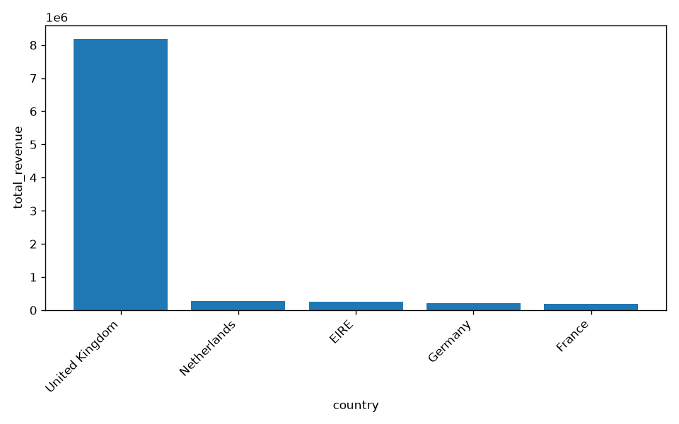
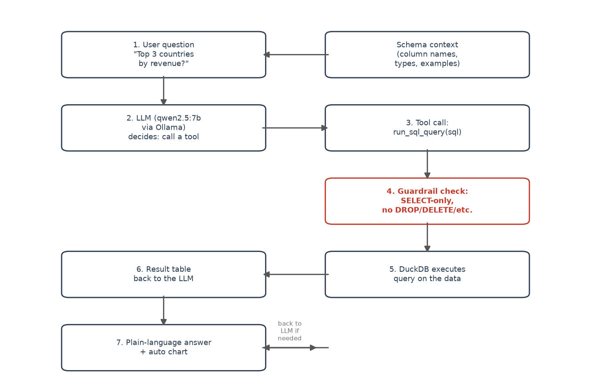

# AI Data Analysis Agent

Ask a dataset questions in plain English and get a real answer back - the agent writes the SQL, runs it safely, and charts the result itself.



## Problem / Motivation

Most people who need an answer from a spreadsheet don't know SQL or pandas - they either bug someone who does, or give up. This project explores the "text-to-query" pattern behind tools like this: a local LLM reads a plain-English question, decides which SQL query answers it, and a small amount of Python code executes that query safely and turns the result into text plus a chart. No cloud API required - everything runs locally via [Ollama](https://ollama.com).

## Key Findings / Features

- **Runs fully local and free**: uses Ollama with `qwen2.5:7b` on-device - no API key, no per-query cost, works offline.
- **Schema context is what makes it work at all**: without telling the model the real column names, it confidently invents plausible-sounding but wrong ones (tested side by side in `explore_schema.py`).
- **Guardrails, not trust**: every query the model writes is checked before execution - only single `SELECT` statements are allowed, so the model has no way to modify or delete data even by mistake.
- **A real bug, found and fixed**: the model initially misread a large total (reported "974,774.80" instead of "9,747,747.93") because the query result was handed to it in scientific notation (`9.747748e+06`). Fixing the number formatting - not the model - fixed the answer.
- **Auto-visualization without asking the LLM to plot**: chart type (bar vs. line) is picked from the shape of the query result in plain Python, which is simpler and more reliable than trusting the model to write correct plotting code.

## Tech Stack

- Python 3, [Ollama](https://ollama.com) running `qwen2.5:7b` (local LLM, tool-calling)
- DuckDB (runs SQL directly against a pandas DataFrame)
- pandas, matplotlib
- Streamlit (chat interface)
- Data: [UCI Online Retail dataset](https://archive.ics.uci.edu/dataset/352/online+retail) (same dataset as `sales-performance-analysis`), or any uploaded CSV

## How it works



1. The dataset's schema (column names, types, example values) is built into a short text block (`schema_context.py`) and given to the model as context - not the raw data itself.
2. The user's question and that schema go to the LLM (`agent.py`), which can call one tool: `run_sql_query`.
3. Before any query touches the data, `query_engine.py` checks it's a single, read-only `SELECT` statement - anything else (`DROP`, `DELETE`, `INSERT`, ...) is rejected before DuckDB ever sees it.
4. DuckDB runs the query against the DataFrame and returns a result table, formatted as fixed-point decimals so the model reads numbers correctly.
5. The model turns the result into a plain-language answer; `visualize.py` separately decides whether the result's shape (categorical or time-based, multiple rows) warrants an auto-generated chart.
6. `app.py` wraps all of this in a Streamlit chat interface, with an optional CSV upload for any other dataset.

## Getting Started

```bash
git clone https://github.com/Tanos3000/ai-data-analysis-agent.git
cd ai-data-analysis-agent
python3 -m venv venv
source venv/bin/activate
pip install -r requirements.txt

ollama pull qwen2.5:7b    # one-time local model download
python download_data.py   # downloads the sample dataset into data/

streamlit run app.py
```

## Data Source

[UCI Online Retail dataset](https://archive.ics.uci.edu/dataset/352/online+retail) - 541,909 real transactions from a UK-based online retailer, December 2010 to December 2011. The app also accepts any other CSV via upload.

## What I learned

The most useful lesson wasn't about prompting - it was that a local 7B model is perfectly capable of writing correct SQL, but can still fail downstream by misreading its own tool's output if that output is formatted awkwardly (scientific notation, in this case). It reinforced that "the model got it wrong" often really means "the code handed it something confusing," and that's a bug I can fix, not a model limitation I have to work around. I also learned to be deliberate about what the model is trusted to decide versus what stays fixed, deterministic Python: it decides *which* SQL query to run, but not *how* to plot the result - that split kept the whole system a lot more predictable.
